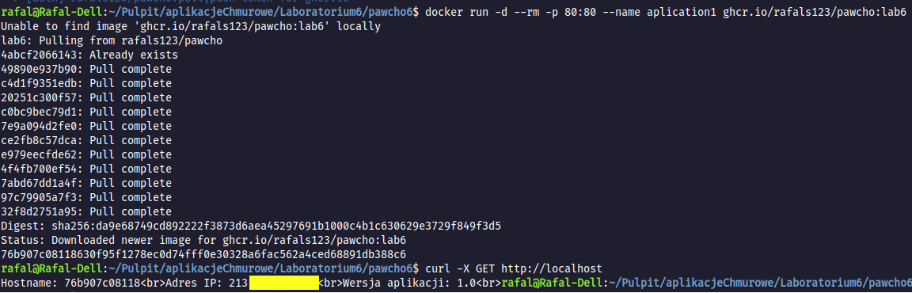

# Laboratory 6 - using a Dockerfile as a frontend for the Buildkit engine

## Basic source
The solution to this task was based on the solution to the task from [Laboratory 5](https://github.com/rafals123/Laboratorium-5).

## What is it actually? Step by step explanation
The first step of executing the task was to use the Dockerfile from the previous solution as a base (which was then extended, as I'll explain in a moment), additionally, I added an Alpine file in tar format to the current repository. Firstly, in the solution of the task in Laboratory 5, files were copied from the host. Currently, the main change is cloning the necessary files, which already exist in the previously linked repository. To achieve this, it was crucial to add these commands to the Dockerfile:

```bash
apk add git
```
The above command installs the Git client.

```bash
apk add openssh-client
```
The openssh-client command is also responsible for installing the client.
These commands are necessary to fetch the source code during image building, as well as for SSH authentication.
Moving forward, we have the following code snippet:

```bash
RUN mkdir -p -m 0700 ~/.ssh && ssh-keyscan github.com >> ~/.ssh/known_hosts \
    && eval $(ssh-agent)
```

This command creates the ~/.ssh directory (if it doesn't exist) with appropriate permissions, ensuring that only the owner will have access to this directory. Then, ssh-keyscan scans the host key for the GitHub server and adds it to the ~/.ssh/known_hosts file. This is useful to avoid warnings about unknown host keys when connecting via SSH, enabling automatic trust for the host in the future. This also prevents possible "man-in-the-middle" attacks.
Continuing further, we have the following fragment of the Dockerfile:

```bash
RUN --mount=type=ssh git clone git@github.com:rafals123/Laboratorium-5.git
```
This command clones a GitHub repository using the SSH protocol, while the flag --mount=type=ssh allows mounting the SSH private key within the Docker container.
The next change in the code is the following fragment:
```bash
RUN npm install && rm -f ReadMe.pdf Dockerfile ReadMe.txt alpine-minirootfs-3.19.1-x86_64.tar
```
While the command RUN npm install is self-explanatory, it's worth noting that I'am also removing relevant files that were previously cloned from the repository, as they won't be needed in the current stage of the task.
These are the main changes that needed clarification to make the subsequent part seem simpler. Therefore, after a very long introduction, we can finally move on!

# Building an image
To build an image using Buildkit, I first installed the tool on my operating system (Linux Mint 21.3.) using [this website](https://github.com/moby/buildkit/releases/tag/v0.13.1).
I unpacked the entire file, and then I copied the contents of the bin directory to the location /bin.

Then, I had to run Buildkit in a dedicated container. Based on the lecture materials, I could do this using the following command:

```bash
docker run -d --rm --name buildkitd --privileged moby/buildkit:latest
```
Next, from the Terminal, I executed the following command:

```bash
export BUILDKIT_HOST=docker-container://buildkitd
```
Setting the environment variable BUILDKIT_HOST informs Docker to use an external build process, buildkitd, to process Dockerfile instructions.

After the necessary configuration, we can finally build the image using buildctl.

## Using buildctl to build an image
To build the image, I simply executed the following command (specifying the image version is optional):
```bash
buildctl build --frontend=dockerfile.v0 --ssh default=$SSH_AUTH_SOCK --local context=. --local dockerfile=. --opt build-arg:VERSION=1.0 --output type=image,name=ghcr.io/rafals123/pawcho:lab6,push=true
```
If you want to use this command, make sure to change the target repository to ghcr.io.

## Starting a container
Finally, we can create and start the container. Simply use the following command.


```bash
docker run -d --rm -p 80:80 --name application1 ghcr.io/rafals123/pawcho:lab6
```
As mentioned above, when executing the command, remember to change the relevant part accordingly.


## How can I check it?
To check if this works, I simply used the following command:

```bash
curl -X GET http://localhost
```

# Result:



## Last, but not least

To ensure that the task solution is visible, I had to change the package visibility to public.

